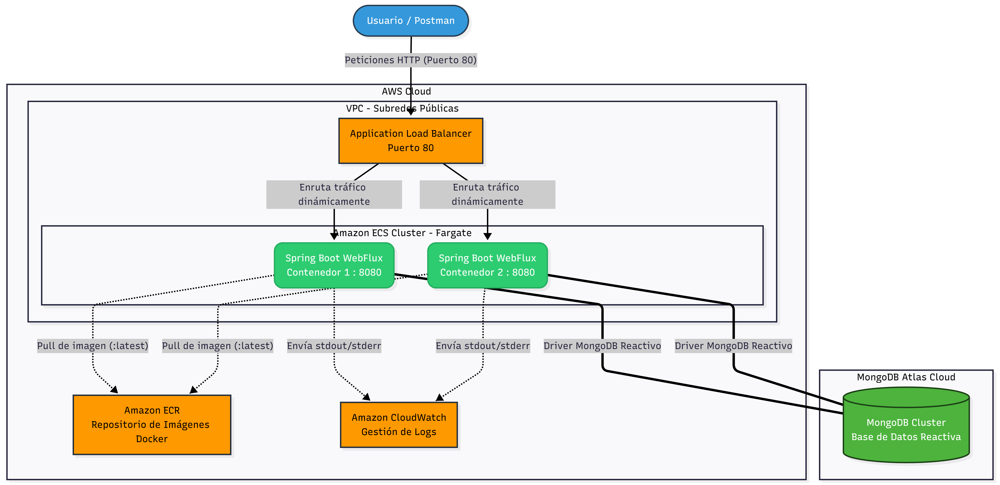

# API de Gestión de Franquicias (Spring WebFlux)

## Arquitectura y Patrones de Diseño

El proyecto está diseñado siguiendo los principios de la **Arquitectura Hexagonal (Puertos y Adaptadores)** y **Domain-Driven Design (DDD)** ligero.

- **Capa de Dominio:** Contiene las entidades core (`Franchise`, `Branch`, `Product`) y Value Objects (`Stock`) que encapsulan las reglas de negocio, totalmente agnósticas a los frameworks.
- **Capa de Aplicación:** Define los Casos de Uso (Puertos de Entrada) y las interfaces de los Repositorios (Puertos de Salida).
- **Capa de Infraestructura:** Implementa los adaptadores REST (usando `RouterFunctions` y `Handlers` de WebFlux), la persistencia (Spring Data R2DBC/MongoDB Reactive) y el manejo global de excepciones.

## Características Principales

- **Documentación Interactiva (Swagger):** Integración con OpenAPI 3 / Swagger UI para explorar, documentar y probar visualmente todas las rutas funcionales (RouterFunctions) de la API.
- **Infraestructura como Código (IaC):** GCreación y gestión del clúster de base de datos en MongoDB Atlas y de los recursos de red/cómputo de AWS utilizando Terraform.
- **Despliegue Cloud Escalable en AWS:** Contenedorización de la aplicación ejecutada en Amazon ECS (Fargate) balanceada a través de un Application Load Balancer (ALB), permitiendo escalabilidad horizontal sin gestión de servidores
- **100% Reactivo:** Implementado con Project Reactor (Mono/Flux) de principio a fin, evitando bloqueos de hilos (Non-blocking I/O).
- **Validaciones Rigurosas:** Uso de `jakarta.validation` adaptado a WebFlux con un `GlobalExceptionHandler` unificado (RFC 7807).
- **Cobertura de Pruebas:** Tests unitarios y de integración con `WebTestClient` y `Mockito`.
- **Dockerizado:** Imagen construida mediante un *Multi-stage build* optimizado, ejecutándose en un entorno ligero (Alpine) con un usuario no-root por seguridad.

## Diagrama de despliegue

## Requisitos Previos

- Java 17 o superior.
- Maven 3.8+ (o usar el Wrapper incluido).
- Docker y Docker Compose (opcional, para la base de datos o el despliegue).
- Instancia de MongoDB (local o Atlas).

## Instalación y Ejecución Local

### Opción 1: Usando Docker

1. **Construir la imagen de Docker:**
       
    docker build -t franquicias-api:1.0.0 .

2. **Construir la imagen de Docker:**

    # En Windows/Mac:

    docker run -p 8080:8080 -e SPRING_DATA_MONGODB_URI=mongodb://host.docker.internal:27017/franquicias_db --name franquicias-app franquicias-api:1.0.0

    # En Linux:

    docker run -p 8080:8080 --add-host host.docker.internal:host-gateway -e SPRING_DATA_MONGODB_URI=mongodb://host.docker.internal:27017/franquicias_db --name franquicias-app franquicias-api:1.0.0

### Opción 2: Usando Maven

    # Asegúrate de que MongoDB esté corriendo localmente en localhost:27017.

    ./mvnw clean spring-boot:run

### Correr pruebas untiaria

    ./mvnw clean verify

## Endpoints Principales

La API base en local se encuentra en `http://localhost:8080/api/v1`.

La API base en AWS (ALB) se encuentra en `http://franquicias-alb-2002530892.us-east-1.elb.amazonaws.com/api/v1`.

| Entidad | Método | Endpoint | Descripción |
| :--- | :--- | :--- | :--- |
| **Franquicia** | `POST`  | `/franchises` | Crea una nueva franquicia |
| **Franquicia** | `PATCH` | `/franchises/{id}/name` | Actualiza el nombre de la franquicia |
| **Sucursal** | `POST`  | `/branches` | Crea una sucursal para una franquicia |
| **Sucursal** | `PATCH` | `/branches/{id}/name` | Actualiza el nombre de la sucursal |
| **Producto** | `POST`  | `/products` | Agrega un producto a una sucursal |
| **Producto** | `DELETE`| `/products/{id}` | Elimina un producto de una sucursal |
| **Producto** | `PATCH` | `/products/{id}/stock` | Modifica el stock de un producto |
| **Producto** | `PATCH` | `/products/{id}/name` | Actualiza el nombre de un producto |
| **Reportes** | `GET`   | `/franchises/{id}/max-stock`| Obtiene el producto con más stock por sucursal |

